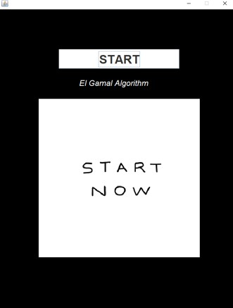

# El Gamal Algorithm
## Introduction
This is a code that simulates how does the El Gamal Algorithm work. 
## Steps in the algorithm
You can see bellow all the steps needed in such a simulation.

### Start
In the beginning it was... A BUTTON!   The start button that starts everything. 

